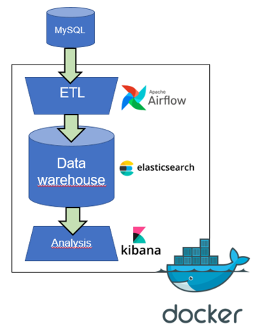

> IMPORTANT This is for demonstration purpose only and should not be used in a production environment.

# Research Data Integration Stack
This project represents the configuration utilized at CARSM (Center for Advanced Research in Sleep Medicine) to integrate our research data into a centralized data warehouse for improved visualization, querying, and analysis. This 
project will help you create a complete data integration stack with a dummy biobank mysql database and visualisation.

To jump right into the installation: [Getting started](#getting-started). To understand what this is all about, please keep on reading!

# The Stack
Let's take a moment to discuss what you'll be setting up – the stack. The stack represents all the software we require to retrieve, store, and analyze data.



## First layer: Data Sources
The first layer of the stack comprises the data sources. These encompass various databases and tools employed throughout our research. Initially, we'll solely integrate data from our Biobank; later, we'll incorporate data from RedCap and beyond.

From this project you will be creating a dummy biobank database with MySQL. This is just an example to get you started. You'll need adjust the ETL layer to work with your own data sources if you ever want to use this with your own data.

## Second layer: ETL Layer
The second layer is the ETL layer, with ETL denoting Extract, Transform, and Load. This involves the process of extracting data from the data sources, transforming it into a more manageable format, and then transmitting it to the storage layer.

Within our stack, the ETL layer is managed by Apache Airflow. This tool proves highly beneficial for crafting integration pipelines. If you navigate to the "airflow_volumes" subfolder, you'll encounter a directory labeled **dags**. This directory houses the scripts responsible for extracting, transforming, and loading our data into the storage layer. This is where most of the work will be taking place as we keep on adding new data sources.

## Third layer: Storage layer
The third layer is the storage layer. This is simply a database where we store the data. The database we use is ElasticSearch, which is a distributed, document-oriented NoSQL database optimized for full-text search and real-time data processing. Basically, our data, once transformed, is formatted into a JSON format, and ElasticSearch allows us to query this data.

The storage layer should be fairly stable, and besides tweaking the security features, there's not a whole lot of work to do here regardless of your data sources.

## Fourth layer: The Visualisation Layer
The fourth layer is the visualization layer; this is the layer with which our users interact. We employ Kibana for this purpose. Kibana is a robust open-source tool for data visualization and exploration, enabling us to craft interactive dashboards, execute advanced data queries, and extract insights from our centralized data warehouse.

You'll also be heavily involved in various tasks here, including setting up new dashboards, crafting fresh visualizations, overseeing user management, and more.

## Docker composition file
To establish these components, we rely on Docker containers. Rather than manually installing them individual, Docker streamlines the process by enabling us to configure the setup once and deploy the stack across our production, staging, and developer machines.

At the core of this directory, you'll encounter the docker-compose.yml file. Upon opening this file, you'll observe that it configures various services (such as Airflow, ElasticSearch, Kibana, etc.). The concept behind this approach is to employ a singular docker-compose file for all environments, while adjusting specific variables to target the appropriate data sources of each environement.

# Getting started
## What you need?
- An Ubuntu 22.04 installation. Can be inside a virtual machine running in Virtual Box.
- A Git account with access to this repository.

> If you run it inside a virtual machine, be sure to set it to have at least 2 processors available. 

In summary the steps will be:
- Install Git
- Install Docker
- Create a new user
- Install MySQL server
- Pull this repository in the home folder
- Create the dummy biobank MySQL database
- Modify the environment variables
- Install the integration stack with Docker
- Run the integration pipeline with Airflow
- Import a dashboard into Kibana
- Test the dashboard

> Note, the first installation steps are done with a user with sudo privilege.

## Git installation
Git is used to get this repository.
```
sudo apt update
sudo apt upgrade
sudo apt install git
```

## Docker installation

### Update the apt package index and install packages to allow apt to use a repository over HTTPS:
```
sudo apt install ca-certificates curl gnupg
```

### Add Docker’s official GPG key:
```
sudo install -m 0755 -d /etc/apt/keyrings
curl -fsSL https://download.docker.com/linux/ubuntu/gpg | sudo gpg --dearmor -o /etc/apt/keyrings/docker.gpg
sudo chmod a+r /etc/apt/keyrings/docker.gpg
```

### Use the following command to set up the repository:
```
echo \
  "deb [arch="$(dpkg --print-architecture)" signed-by=/etc/apt/keyrings/docker.gpg] https://download.docker.com/linux/ubuntu \
  "$(. /etc/os-release && echo "$VERSION_CODENAME")" stable" | \
  sudo tee /etc/apt/sources.list.d/docker.list > /dev/null
```

### Install Docker Engine, containerd, and Docker Compose.
```
sudo apt update
sudo apt install docker-ce docker-ce-cli containerd.io docker-buildx-plugin docker-compose-plugin
```
> Press Ok and Ok if asked about kernel and service.

### Verify that the Docker Engine installation is successful by running the hello-world image.
```
sudo docker run hello-world
```

## User creation
Create the user that will run the whole stack. In the command line type:
```
sudo adduser stackuser
```

### Add the new user to the docker group so we don't need to always use sudo
Add the current user to the group
```
sudo usermod -aG docker stackuser
```

## Install MySQL server
Connect with a user with SUDO privilege.
```
sudo apt update
sudo apt upgrade
sudo apt install mysql-server
```

### Change the MySQL settings to allow connections from external IP
```
sudo nano /etc/mysql/mysql.conf.d/mysqld.cnf
# Change the bind adress
bind-address = 0.0.0.0
```

### Add stackuser to mysql
```
sudo mysql
CREATE USER 'stackuser'@'%' IDENTIFIED BY 'not_a_very_good_password';
GRANT ALL PRIVILEGES ON *.* TO 'stackuser'@'%' WITH GRANT OPTION;
FLUSH PRIVILEGES;
exit
sudo service mysql restart
```

### Log with the new stackuser account
Log off and connect with the stackuser account. 

### Test that docker is working correctly with stackuser
```
docker run hello-world
```

## Pull this repository in the home folder
```
cd ~
git clone https://github.com/CEAMSDataIntegration/DockerStack.git
```
> You need to use a Personnal Access Token instead of your password.
> - Go in GitHub, log in.
> - Settings
> - Developer Settings
> - Personal Access Token
> - Tokens (classic)
> - Generate new token

## Create the dummy biobank_dev MySQL database
### Run mysql to execute the SQL script
```
cd /home/stackuser/DockerStack
mysql -p -e "source ./data_sources/biobank_dev/biobank.sql"
```

## Set up your development environment variables
### Change the environment variables in the .env file to match your environment.
By default the values are set to use the dummy MySQL database. You only need to change the AIRFLOW_UID.
Run this command to get the UID of the current linux user, this will become the value of the AIRFLOW_UID variable.
```
echo $(id -u)
```

Modify the value in the .env file:
> Note that the password must be at least 6 caracters in length.
Once done, press CTRL-X and enter to save the changes.
```
nano .env
```
> You can use other text editor like gedit.

## Start docker
Run these command to initialize and start the docker stack.
```
cd /home/stackuser/DockerStack
docker compose up airflow-init
docker compose up elastic-init
docker compose up -d
```
> It might take a few minutes before they all get online.

## Access the stack

- Airflow: http://0.0.0.0:8080
- Elastic: http://0.0.0.0:9200
- Kibana: http://0.0.0.0:5601

## Connect to Airflow to trigger the data integration pipeline
At this point the data warehouse is empty. Airflow is configured to extract the data from the dummy database and import it into the data warehouse everyday at midnight, in order to run it immediately:
1. Open the airflow interface by navigating to: http://0.0.0.0:8080
2. Connect with user:airflow password:airflow
2. In the list of "DAGS" select "mysql_to_elastic_by_sample_view".
4. Press on the play button on the right and trigger the DAG (the integration pipeline).

## Add a dashbord in Kibana
Now that the data warehouse is filled with data from the dummy database. We need to add a dashboard in Kibana. A dashboard is a collection of visualisation called "lenses". We created a few of these lenses to help get started using Kibana.

1. Open the Kibana interface by navigating to: http://0.0.0.0:5601
2. Log as the user: elastic password: not_a_very_good_password
3. On the left menu, select "Stack Management" then "Saved Objects".
4. Press the "Import" link.
5. Drag the file "dashboard_by_sample.ndjson" from the folder "services_setup/kibana/saved_objects". Keep the default options.
6. In the left menu, under the "Analytics" section, select "Dashboard".
7. Select the dashboard named "By sample"


# Now what?
- Play around with the dashboard and the lenses to see how Kibana works.
- Change the passwords to secure the installation properly.
- Add your own data as a data source.

# HOWTOs
### If you want to run a command inside a container
```
docker exec [CONTAINER_ID] [command]
example:
docker exec [CONTAINER_ID] airflow connections list
```

### If you want to see the connection information of an airflow connection set from environment variable
```
docker ps
docker exec [CONTAINER_ID] airflow connections get [CONNECTION_ID]
example:
docker exec e832e287edd9 airflow connections get BIOBANK_DB
```

### List all docker volumes
```
docker volume ls
```

## To see what the docker-compose will be with all variables set before running it.
```
docker compose config
```

## Some clean up command that are useful when working on the docker-compose file
### Stop all containers
```
docker stop $(docker ps -aq)
```

### Remove all containers
```
docker rm $(docker ps -aq)
```

### Remove all docker volumes
```
docker volume rm $(docker volume ls -q)
```

### Remove all networks
```
docker network rm $(docker network ls -q)
```

### Remove all images
```
docker image prune -a
```

### If you need to stop docker and do a fresh restart:
```
docker system prune --all
```

# Troubleshooting
## Airflow - The scheduler does not appear to be running. Last heartbeat was received X minutes ago.
Restart the all docker containers:
```
docker stop $(docker ps -aq)
docker compose up -d
```
